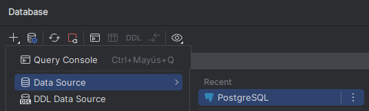
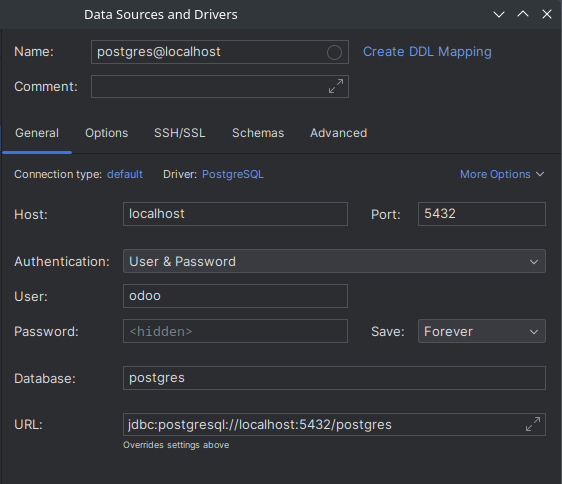
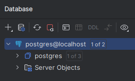
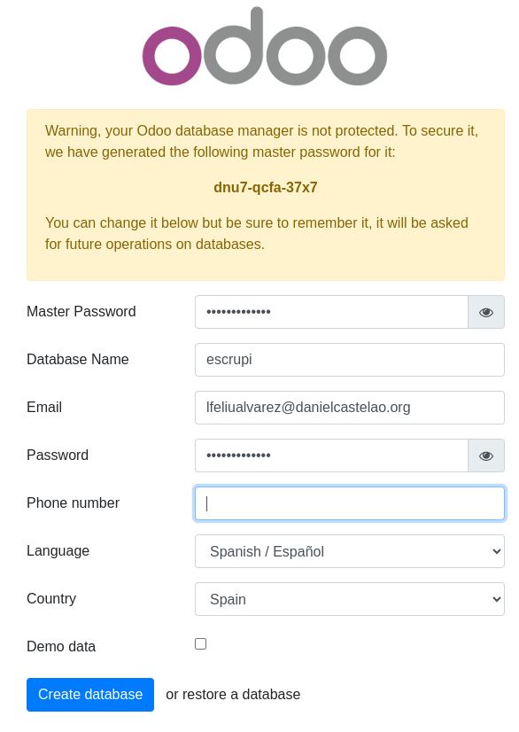
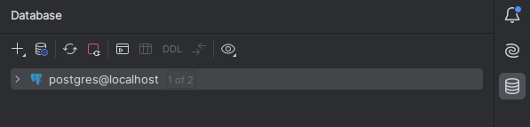
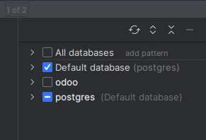

# odoo

## Requerimientos para utilizar Odoo:
- `Una base de datos`(En este caso usaremos *Postgres*)
- `Python` (odoo esta escrito en python y lo necesitaremos para poder hacer algunas funcionalidades)

## Docker compose
### Odoo
```yml
version: '3.1'

services:
  # odoo:
  web:
    image: odoo:16.0
    depends_on:
      - mydb
    ports:
      - "8069:8069"
    environment:
      - HOST=mydb # same name as the postgres service
      - USER=odoo
      - PASSWORD=odoo

  # postgres:
  mydb:
    image: postgres
    ports:
      - "5432:5432"
    environment:
      POSTGRES_DB: postgres
      POSTGRES_PASSWORD: odoo
      POSTGRES_USER: odoo

```
### Postgres
Para poder utilizar odoo requerimos una base de datos, por lo que en este caso usaremos postgres y crearemos otro contenedor para ello.<br>

⚠️ Evita tener el puerto de postgres ocupado ⚠️

#### Comprobar que la base funciona desde un IDE:
Estés en el IDE que estés (PyCharm en este caso), entre los botones de la barra de la derecha buscaremos el botón `Database` donde nos mostrará una ventana con las bases de datos que tenemos.
No tendremos ninguna por lo que persionaremos añadir (➕) , y `Add a Database`, nos aparecera una ventana para elegir el servicio, usaremos postgres, nos aparecera otra ventana donde tan solo hay que poner el nombre de la base de datos, el usuario y la contraseña.
Te pedirá instalar un driver para poder comprobar el funcionamiento de la base, tras descargarlo presiona el botón `Test Connection`, si la conexion es correcta presiona `Apply` y despues `OK`. Ahora en el apartado ` DATABASE` podrás ver la base creada.
<details><summary><b><i>IMAGENES</i></b></summary>
<p>



</p>
</details>

#### Si el puerto está ocupado:

Si el puerto no esta disponible usaremos el siguiente comando para saber quien lo está usando:

```bash
sudo netstat -putan | grep 5432
```
Para liberar el puerto eliminaremos el proceso que lo usaba mediante el comando siguiente:
```bash
sudo kill nombre_del_proceso
```

#### Lanzar docker compose
Para subirlo tendremos que usar el comando `docker-compose up -d`, si no te muestra la página en el siguiente paso ejecuta el comando `docker compose down -v` y vuelve a subirlo.

## Como ver que odoo funciona?
Para ver la página de odoo tendremos que ir a la url `localhost:8069`, nos aparecerá la página de inicio de sesión de odoo. Cuando lo configures ya estará disponible. 


⚠️ En el apartado del nombre de la base tendras que poner un nombre que no sea el de la base de datos de postgres del docker compose, si no es así, dará error ⚠️


### Consultar que la base se ha creado:
En el IDE, en la barra de la derecha seleccionamos el botón de `Database` y nos aparecerá una ventana con nuestra bases de datos. Al lado del nombre del servicio de postgres hay un número, si es 1 presionaremos el botón de refrescar (🔄)<br>



<br> Ahora saldrá al lado de postgres `1 de 2`, le daremos click y seleccionaremos la base de datos que pusimos en la configuración de odoo del paso anterior.
<br>


